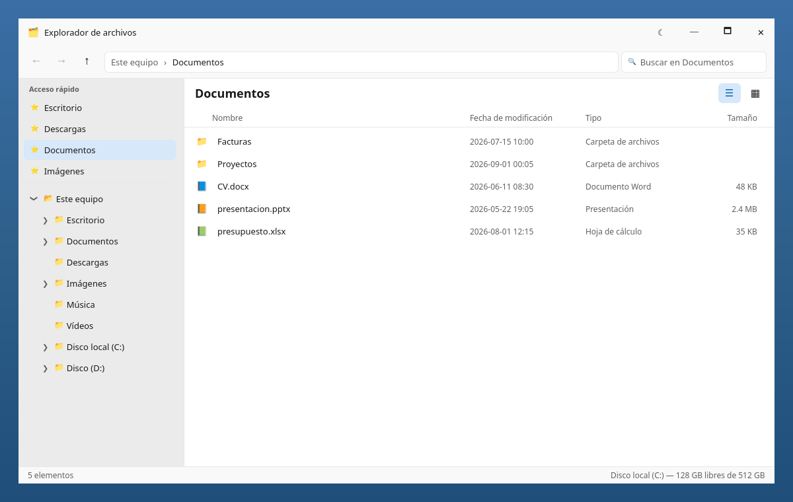

# Explorador de archivos — Spike en QML

Prueba de concepto (**no** implementación real) para evaluar **Qt Quick / QML**
como motor nativo de UI, con estética **Windows 11 / Fluent**. El árbol de
ficheros es **falso** (datos embebidos en `Main.qml`); el objetivo es enseñar el
potencial gráfico, no leer el disco.



## Qué demuestra

- **Árbol de carpetas recursivo** 100 % declarativo (`FolderTree.qml`) con
  expandir/colapsar animado y chevron que rota.
- **Estética Win11**: esquinas redondeadas, barra de acento en la selección,
  hover suave, tipografía tipo Segoe, sombra flotante (`MultiEffect`).
- **Tema claro/oscuro** conmutable en caliente (botón ☾/☀ en la barra de título).
- **Barra de comandos**: atrás/adelante/arriba con historial, **breadcrumb**
  navegable y **búsqueda** que filtra en vivo.
- **Dos vistas**: Detalles (columnas Nombre/Fecha/Tipo/Tamaño) e Iconos grandes.
- **Barra de título propia** (frameless) con minimizar/maximizar/cerrar.

Todo son ~3 ficheros QML + un lanzador. Sin lógica de negocio en Python.

## Requisitos (ya validados en esta máquina)

| Componente | Estado |
|-----------|--------|
| Qt 6.10.2 (sistema) | ✅ |
| Módulos `qml6-module-qtquick-*` | ✅ |
| PyQt6 con QtQuick/QtQml | ✅ (lanzador) |
| Noto Color Emoji | ✅ (iconos a color) |

No hubo nada que descargar: el runtime QML ya está cubierto por Qt 6.10.2 + PyQt6.

## Ejecutar

```bash
./run.sh
```

`run.sh` usa el binario `qml` de Qt si existe (QML puro, sin Python); si no, cae
a PyQt6:

```bash
python3 main.py
```

### Opción "QML puro, sin Python"

Si quieres lanzarlo con el runtime nativo de Qt (sin PyQt6), instala las
herramientas de línea de comandos de Qt (requiere `sudo`):

```bash
sudo apt install qt6-declarative-dev-tools
```

Eso instala el binario `qml`, y entonces:

```bash
qml Main.qml
```

## Generar capturas (sin abrir ventana)

```bash
THEME=dark VIEW=grid OUT=captura.png python3 render.py
```

Usa la plataforma `offscreen`. Nota: en offscreen no hay GPU, así que
`render.py` desactiva la sombra/blur (`effectsEnabled=false`); en ejecución real
sobre Wayland/X11 los efectos sí se renderizan.

## Ficheros

| Fichero | Rol |
|---------|-----|
| `Main.qml` | Ventana, layout, datos falsos, navegación, vistas |
| `FolderTree.qml` | Componente de árbol recursivo (vía `Loader`) |
| `Theme.qml` | Paleta Fluent claro/oscuro |
| `util.js` | Mapeo icono/etiqueta por extensión |
| `main.py` | Lanzador (PyQt6) |
| `render.py` | Renderizador a PNG (offscreen) |

## Notas técnicas de QML aprendidas en el spike

- La **recursión** de componentes no puede ser estática (un `.qml` no se
  instancia a sí mismo por nombre); se hace con un `Loader` cargando el fichero
  por URL. Ver `FolderTree.qml`.
- `MultiEffect` (sombras/blur) **necesita GPU/RHI**: desaparece en la plataforma
  `offscreen`. Por eso el flag `effectsEnabled`.
- `grabWindow()` pertenece a `QQuickWindow`; desde PyQt6 la raíz llega como
  `QWindow` y hay que hacer `sip.cast`.

## Para convertirlo en app "de verdad"

Este spike hace **flotar** la ventana sobre un fondo tipo escritorio (para que
parezca una captura de Win11). Para una app real: quita el `Rectangle` de fondo
con gradiente y los `anchors.margins: 28` del `appRect` para que el explorador
llene la ventana, y sustituye `fsRoot` por un modelo real
(`QFileSystemModel` expuesto a QML, o un backend en Rust/C#/Python).
